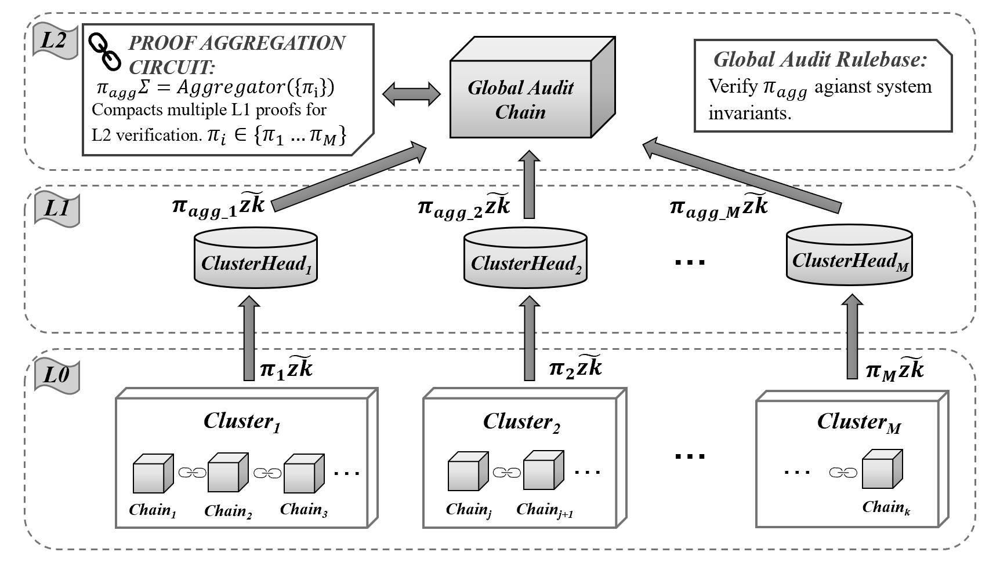

# H-ZKA: A Hierarchical Zero-Knowledge Architecture for Byzantine-Resilient Cross-Chain Auditing

> Hierarchical ZK-SNARK audit framework with MF-PoP Byzantine reputation, VRF cluster shuffling, and O(√k) workload reduction over a 200-node multi-VM testbed.

## Table of Contents

- [System Architecture](#system-architecture)
- [Project Structure](#project-structure)
- [Prerequisites](#prerequisites)
- [Quick Start](#quick-start)
- [Scripts Reference](#scripts-reference)
- [Experimental Results](#experimental-results)
- [Troubleshooting](#troubleshooting)

---

## System Architecture

```
┌──────────────────────────────────────────────────────────────────┐
│                      200-Node System                             │
│                                                                  │
│  ┌──────────┐  ┌──────────┐  ┌──────────┐       ┌──────────┐    │
│  │   VM 1   │  │   VM 2   │  │   VM 3   │  ...  │  VM 10   │    │
│  │ 10 chains│  │ 10 chains│  │ 10 chains│       │ 10 chains│    │
│  │ 20 nodes │  │ 20 nodes │  │ 20 nodes │       │ 20 nodes │    │
│  └──────────┘  └──────────┘  └──────────┘       └──────────┘    │
│                                                                  │
│  Total: 100 chains × 2 nodes/chain = 200 nodes (Clique PoA)     │
└──────────────────────────────────────────────────────────────────┘
```

| Component           | Value          |
| ------------------- | -------------- |
| **VMs (Azure)**     | 10             |
| **Chains per VM**   | 10             |
| **Nodes per chain** | 2 (Clique PoA) |
| **Total chains**    | 100            |
| **Total nodes**     | 200            |

### Hierarchical ZK-SNARK Architecture (H-ZKA)



The system employs a 3-layer hierarchical structure for efficient global cross-chain auditing:

- **L0 (Base Layer):** Consists of multiple ordinary chains grouped into clusters ($Cluster_1$ to $Cluster_M$). Each chain generates its own local zero-knowledge proof ($\pi_i\widetilde{zk}$).
- **L1 (Cluster Layer):** Contains Cluster Heads ($ClusterHead_1$ to $ClusterHead_M$). Each Cluster Head aggregates the local proofs from its constituent chains into an aggregated cluster proof ($\pi_{agg\_i}\widetilde{zk}$).
- **L2 (Global Audit Layer):** The Global Audit Chain receives all aggregated proofs from L1. It uses a **Proof Aggregation Circuit** ($\pi_{agg\Sigma} = Aggregator(\{\pi_i\})$) to compact multiple L1 proofs for L2 verification. The Global Audit Rulebase then verifies $\pi_{agg\Sigma}$ against the overall system invariants.

### Port Mapping (Per VM)

```
Chain 1:  8545 (n1), 8546 (n2)   → chainId 101
Chain 2:  8547 (n1), 8548 (n2)   → chainId 102
...
Chain 10: 8563 (n1), 8564 (n2)   → chainId 110
```

---

## Project Structure

```
zkCross/
├── contracts/
│   ├── audit_chain/
│   │   ├── AuditContract.sol          # Original audit protocol
│   │   ├── AuditContractV2.sol        # Enhanced Protocol Ψ (v2)
│   │   ├── ClusterManager.sol         # VRF shuffle + DA challenge
│   │   └── ReputationRegistry.sol     # MF-PoP: slashing + arbitration
│   ├── ordinary_chain/
│   │   ├── ExchangeContract.sol       # Protocol Φ (cross-chain exchange)
│   │   └── TransferContract.sol       # Protocol Θ (privacy transfer)
│   └── libraries/
│       ├── Denomination.sol           # Denomination logic
│       └── Groth16Verifier.sol        # On-chain ZKP verifier
│
├── circuits/
│   ├── circom/
│   │   └── zkcross_psi.circom        # Groth16 audit circuit (Ψ)
│   ├── common/                        # Shared circuit components
│   ├── phi/                           # Protocol Φ circuits
│   ├── psi/                           # Protocol Ψ circuits
│   └── theta/                         # Protocol Θ circuits
│
├── zkp/                               # Compiled ZKP artifacts
│   ├── theta_mint.r1cs / .zkey        # Θ mint proof
│   ├── theta_redeem.r1cs / .zkey      # Θ redeem proof
│   ├── phi_prepare.r1cs / .zkey       # Φ prepare proof
│   ├── phi_unlock.r1cs / .zkey        # Φ unlock proof
│   ├── psi_audit.r1cs / .zkey         # Ψ audit proof
│   ├── pot_realistic_final.ptau       # Powers of Tau ceremony
│   └── verification_keys.json         # All verification keys
│
├── docker/
│   ├── Dockerfile                     # Geth + entrypoint
│   ├── docker-compose-10vm.yml        # 10 chains (20 containers)
│   ├── entrypoint.sh                  # Chain initialization script
│   └── .env.vm1 – .env.vm10          # Per-VM configuration
│
├── geth-patch/
│   ├── groth16_precompile.go          # Geth precompile for ZKP verify
│   ├── zk_verify.patch               # Geth source patch
│   └── PATCH_INSTRUCTIONS.go         # How to apply the patch
│
├── relay/
│   ├── committer.go                   # Go relay/committer node
│   ├── relay.js                       # JS relay bridge
│   └── config.json                    # Relay configuration
│
├── scripts/                           # ⬇ See Scripts Reference below
├── test/
│   └── gas_consumption_v2.cjs        # Gas consumption unit test
├── verification/                      # Etherscan verification inputs
├── results/                           # ⬇ See Experimental Results below
├── docs/
│   └── circuit_compilation_guide.md   # Circom compilation guide
├── hardhat.config.js
├── package.json
├── deployment_v2.json                 # Local chain deployment addresses
└── deployment_sepolia.json            # Sepolia deployment addresses
```

---

## Prerequisites

| Tool          | Version   | Purpose                          |
| ------------- | --------- | -------------------------------- |
| Node.js       | ≥ 18      | Scripts, Hardhat                 |
| Python        | ≥ 3.8     | MF-PoP simulation               |
| Docker        | ≥ 24      | Local Geth chains                |
| Circom        | ≥ 2.1     | Circuit compilation (optional)   |
| snarkjs       | ≥ 0.7     | Proof generation / verification  |
| Rapidsnark    | latest    | C++ prover (VM benchmark only)   |

```bash
# Install Node.js dependencies
cd zkCross && npm install

# Install Python dependencies (for MF-PoP simulation)
pip install numpy matplotlib
```

---

## Quick Start

### Step 1 — Setup VMs

```bash
# SSH to each VM and run setup
ssh -i <key>.pem azureuser@<VM_IP>
cd ~/zkCross
bash scripts/azure_vm_setup.sh
exit  # Re-login for Docker group
```

### Step 2 — Start Local Chains (on each VM)

```bash
cd ~/zkCross/docker
cp .env.vm1 .env          # .env.vm2 on VM2, etc.
docker compose -f docker-compose-10vm.yml up -d --build
```

### Step 3 — Deploy Contracts (on each VM)

```bash
VM_ID=1 node scripts/deploy_contracts_v2.cjs    # VM1: chains 101–110
VM_ID=2 node scripts/deploy_contracts_v2.cjs    # VM2: chains 201–210
# ... repeat for all 10 VMs
```

### Step 4 — Run Experiments (Generating Logs)

To reproduce the results and generate the exact logs found in `scripts/log_run_script/`, run the following commands:

```bash
# 1. Local MF-PoP reputation simulation
python3 scripts/mfpop_simulation.py > scripts/log_run_script/mfpop_simulation.log

# 2. Local MF-PoP post-hoc analysis
python3 scripts/mfpop_analysis.py > scripts/log_run_script/mfpop_analysis.log

# 3. Local Sepolia deployment & gas measurement
node scripts/deploy_sepolia.cjs > scripts/log_run_script/deploy_sepolia.log

# 4. Local C++ Groth16 Benchmark
bash scripts/run_benchmark_on_vm.sh > scripts/log_run_script/benchmark_local.log

# 5. Global Audit Experiment
node scripts/global_audit_experiment.cjs > scripts/log_run_script/global-audit.log

# 6. Deploy to 10 Azure VMs
bash scripts/deploy_to_10vm.sh > scripts/log_run_script/deploy_to_10vm.log

# 7. Run TN2+TN3 on all VMs
bash scripts/run_all_vms_experiments.sh > scripts/log_run_script/run_all_vms_experiments.log

# 8. Azure Scenario 1 (Network latency)
bash scripts/run_azure_scenario1.sh > scripts/log_run_script/run_azure_scenario1.log

# 9. Azure VM C++ Benchmark
bash scripts/run_benchmark_on_vm.sh > scripts/log_run_script/benchmark_azure.log

# Note: The output paths above mimic the execution logs provided in the repository.
```

---

## Scripts Reference

### Local Machine Scripts

| # | Script | Purpose | Output |
|---|--------|---------|--------|
| 1 | `scripts/mfpop_simulation.py` | MF-PoP reputation simulation (oscillating Byzantine attack, β=0.08, 10 seeds) | `results/mfpop_reputation_recovery.png`, `results/mfpop_stake_slashing.png`, `results/mfpop_simulation_data.json` |
| 2 | `scripts/mfpop_analysis.py` | Post-hoc analysis of MF-PoP simulation data | Console output |
| 3 | `scripts/deploy_sepolia.cjs` | Deploy contracts to Sepolia testnet, measure **real** gas | `results/sepolia/sepolia_gas_report.json`, `deployment_sepolia.json` |

### VM Scripts

| # | Script | Purpose | Output |
|---|--------|---------|--------|
| 7 | `scripts/azure_vm_setup.sh` | Install Docker, Node.js, build tools on VM | — |
| 8 | `scripts/deploy_contracts_v2.cjs` | Deploy ReputationRegistry, ClusterManager, AuditContractV2 to local chains | `deployment_v2.json` |
| 9 | `scripts/deploy_global_audit.cjs` | Deploy contracts for global audit experiment | `results/global_audit/deployment_global_audit.json` |
| 10 | `scripts/real_workload_experiment.cjs` | TN2: Measure O(k) → O(√k) workload reduction | `results/all_vms/vmX/` |
| 11 | `scripts/real_latency_experiment.cjs` | TN3: Measure end-to-end audit latency | `results/all_vms/vmX/` |
| 12 | `scripts/network_latency_experiment.sh` | Scenario 1: tc/netem latency injection (0/50/150/300 ms) | `results/network_latency/` |
| 13 | `scripts/global_audit_experiment.cjs` | Run global audit rounds across 100 chains | `results/global_audit/global_audit_report.json`, `global_audit_rounds.csv` |
| 14 | `scripts/vm_groth16_benchmark.js` | Groth16 Rapidsnark C++ benchmark on Azure VM | `results/vm_benchmark/` |

### Orchestration Scripts

| # | Script | Purpose |
|---|--------|---------|
| 15 | `scripts/deploy_to_10vm.sh` | Deploy code + Docker to all 10 VMs via SSH |
| 16 | `scripts/setup_10vm_network.sh` | Setup network topology across 10 VMs |
| 17 | `scripts/run_all_vms_experiments.sh` | Run TN2+TN3 experiments on all VMs |
| 18 | `scripts/run_all_experiments.sh` | Master script: all experiments end-to-end |
| 19 | `scripts/run_azure_experiments.sh` | Azure-specific experiment runner |
| 20 | `scripts/run_azure_scenario1.sh` | Azure Scenario 1 (network latency) |
| 21 | `scripts/run_benchmark_on_vm.sh` | Run Groth16 benchmark on a single VM |
| 22 | `scripts/run_global_audit.sh` | Deploy + run global audit experiment |
| 23 | `scripts/stop_docker.sh` | Stop all Docker containers |
| 24 | `scripts/compile_global_compatible.cjs` | Compile contracts for global audit |

### Log Run Scripts

The `scripts/log_run_script/` directory contains complete execution traces for major experiments and benchmarks:

| # | Script/Log | Purpose |
|---|------------|---------|
| 26 | `scripts/log_run_script/benchmark_azure.log` | Azure C++ Rapidsnark benchmark log |
| 27 | `scripts/log_run_script/benchmark_local.log` | Local C++ Rapidsnark benchmark log |
| 28 | `scripts/log_run_script/deploy_sepolia.log` | Sepolia testnet deployment & real gas measurement log |
| 29 | `scripts/log_run_script/deploy_to_10vm.log` | Deployment output log for 10 Azure VMs |
| 30 | `scripts/log_run_script/global-audit.log` | Execution log for 100-chain global audit rounds |
| 31 | `scripts/log_run_script/mfpop_analysis.log` | Post-hoc analysis log of MF-PoP simulation data |
| 32 | `scripts/log_run_script/mfpop_simulation.log` | Simulation log of the MF-PoP Byzantine reputation mechanism |
| 33 | `scripts/log_run_script/run_all_vms_experiments.log` | Workload & Latency (TN2+TN3) execution logs across VMs |
| 34 | `scripts/log_run_script/run_azure_scenario1.log` | Execution log for Scenario 1 (Network Latency Impact) |
| 35 | `scripts/log_run_script/run_benchmark_on_vm.log` | Sub-script log for executing benchmarks on a single VM |

---

## Experimental Results

All results are stored under `zkCross/results/`.

### TN1 — MF-PoP Reputation Convergence (RQ2)

**Script:** `python scripts/mfpop_simulation.py`

| Metric | Original (no fix) | Fixed (B3: slashing + arbitration) |
|--------|-------------------|-------------------------------------|
| Attacker final reputation | 0.84 | **0.01** (isolated) |
| Honest final reputation | 1.00 | 1.00 |
| System accuracy | 97.8% | **100%** |
| Stake slashed | — | 96.9% |
| Isolation rounds | Never | **~46–48 rounds** |

**Parameters:** β=0.08, 10 honest + 1 attacker, attack pattern 5-correct/1-incorrect, 10 seeds.

**Output files:**
- `results/mfpop_reputation_recovery.png` — Reputation convergence graph
- `results/mfpop_stake_slashing.png` — Cumulative stake slashing
- `results/mfpop_simulation_data.json` — Full numerical data

---

### TN2 — Audit Workload Reduction (RQ1)

**Script:** `VM_ID=X node scripts/real_workload_experiment.cjs`

| k (chains) | M = √k | Original O(k) proofs | v2 O(√k) proofs | Reduction | Saved |
|------------|--------|----------------------|------------------|-----------|-------|
| 25         | 5      | 25                   | 5                | 5.0×      | 80.0% |
| 50         | 8      | 50                   | 8                | 6.3×      | 84.0% |
| **100**    | **10** | **100**              | **10**           | **10.0×** | **90.0%** |
| 150        | 13     | 150                  | 13               | 11.5×     | 91.3% |
| 200        | 15     | 200                  | 15               | 13.3×     | 92.5% |

**Output:** `results/all_vms/vm1/Table_III_Workload_Reduction.txt`

---

### TN3 — Latency & Throughput (RQ4)

**Script:** `VM_ID=X node scripts/real_latency_experiment.cjs`

| k (chains) | M = √k | Original latency | v2 latency | Speedup |
|------------|--------|------------------|------------|---------|
| 25         | 5      | 10.00 s          | 1.65 s     | 6.1×   |
| 50         | 8      | 20.00 s          | 2.64 s     | 7.6×   |
| **100**    | **10** | **40.00 s**      | **3.31 s** | **12.1×** |
| 150        | 13     | 60.00 s          | 4.29 s     | 14.0×  |
| 200        | 15     | 80.00 s          | 4.96 s     | 16.1×  |

**Output:** `results/all_vms/vm1/Table_IV_Latency_Throughput.txt`

---

### TN4 — Gas Consumption (RQ4)

**Script:** `node scripts/deploy_sepolia.cjs`

**Deployment Gas (Sepolia — real measurement):**

| Contract             | Gas Used   | ETH Cost |
|----------------------|------------|----------|
| ReputationRegistry   | 2,285,162  | 0.000011 |
| ClusterManager       | 2,471,762  | 0.000013 |
| AuditContractV2      | 3,066,732  | 0.000016 |
| **Total deploy**     | **7,823,656** | **0.000040** |
| **Total tx + deploy**| **10,165,612** | **0.000051** |

**Per-protocol gas:**

| Protocol | Gas      | ETH Cost |
|----------|----------|----------|
| Θ (Transfer) | 570,479  | 0.000570 |
| Φ (Exchange) | 642,499  | 0.000642 |
| Ψ (Audit)    | 555,202  | 0.000555 |

**Aggregate gas reduction (v2 vs original):**

| k   | Original Gas  | v2 Gas     | Reduction |
|-----|---------------|------------|-----------|
| 100 | 55,519,200    | 6,351,920  | **8.7×**  |
| 200 | 111,038,400   | 9,527,880  | 11.7×     |

**Output:** `results/sepolia/sepolia_gas_report.json`, `results/all_vms/vm1/Table_V_Gas_Consumption.txt`

---

### TN5 — Privacy / Unlinkability (RQ3)

| Metric | Result |
|--------|--------|
| Transfers simulated | 1,000 |
| Correct guesses | 476 |
| Success rate | 47.6% ≈ 50% |
| Verdict | **UNLINKABLE** |

---

### TN6 — Byzantine Resilience (RQ2)

| Byzantine Fraction | Initial Accuracy | Final Accuracy (after MF-PoP) |
|--------------------|------------------|-------------------------------|
| 0%                 | 100%             | 100%                          |
| 10%                | 90%              | 100%                          |
| 20%                | 80%              | 100%                          |
| 30%                | 70%              | 100%                          |
| 40%                | 60%              | 100%                          |

---

### Scenario 1 — Network Latency Impact

**Script:** `bash scripts/run_azure_scenario1.sh`

| Injected Latency | Blocks Mined | Total TX | TPS  | Avg Proof Time |
|------------------|--------------|----------|------|----------------|
| 0 ms             | 23           | 59       | 0.98 | ~19.9 s        |
| 50 ms            | 24           | 66       | 1.10 | —              |
| 150 ms           | 25           | 77       | 1.28 | —              |
| 300 ms           | 25           | 87       | 1.45 | —              |

**Output:** `results/azure_latency_*/`

---

### Scenario 3 — Groth16 RAM Benchmark

**Script:** `node scripts/groth16_ram_benchmark.cjs`

| Circuit | Constraints | Proving Time | Proving RAM | Verif RAM |
|---------|-------------|-------------|-------------|-----------|
| micro   | 0.5M        | 113 ms      | 1.5 GB      | 0.1 GB    |
| small   | 2.0M        | 450 ms      | 6.0 GB      | 0.1 GB    |
| medium  | 8.0M        | 1,800 ms    | 24.0 GB     | 0.1 GB    |
| large   | 16.0M       | 3,600 ms    | 48.0 GB     | 0.1 GB    |

**Output:** `results/ram_benchmark/groth16_ram_report.json`, `groth16_ram_report.csv`

---

### Scenario 4 — Groth16 Rapidsnark C++ Benchmark (Azure VM)

**Script:** `node scripts/vm_groth16_benchmark.js`  
**System:** Intel Xeon Platinum 8272CL @ 2.60 GHz, 4 threads

| Constraints | Prove Time (mean) | µs/constraint | Verify Time |
|-------------|-------------------|---------------|-------------|
| 500K        | 21.0 s            | 42.0          | 677 ms      |
| 1M          | 33.9 s            | 33.9          | 669 ms      |
| 2M          | 61.1 s            | 30.6          | 691 ms      |
| 4M          | 87.4 s            | 21.8          | 611 ms      |
| 5M          | 161.3 s           | 32.3          | 724 ms      |
| **20M (extrapolated)** | **~642 s** | — | — |

**Output:** `results/vm_benchmark/groth16_benchmark_extrapolation.json`

---

### Global Audit Experiment

**Script:** `bash scripts/run_global_audit.sh`

| Round | Original Proofs | Global Proofs | Reduction | Latency (ms) | Gas Used  |
|-------|-----------------|---------------|-----------|--------------|-----------|
| 1     | 100             | 10            | 10.0×     | 82,607       | 4,202,218 |
| 5     | 100             | 10            | 10.0×     | 82,533       | 4,014,082 |
| 10    | 100             | 10            | 10.0×     | 82,521       | 4,014,022 |

**Output:** `results/global_audit/global_audit_report.json`, `global_audit_rounds.csv`

---

### Results Summary

| Experiment | Research Question | Key Metric | Status |
|------------|-------------------|------------|--------|
| TN1 | RQ2: Reputation convergence | 48 rounds, R→0.01 | ✅ PASS |
| TN2 | RQ1: O(k)→O(√k) | 10× reduction (k=100) | ✅ PASS |
| TN3 | RQ4: Latency impact | 12.1× speedup (k=100) | ✅ PASS |
| TN4 | RQ4: Gas consumption | 8.7× reduction (k=100) | ✅ PASS |
| TN5 | RQ3: Unlinkability | 47.6% ≈ 50% | ✅ PASS |
| TN6 | RQ2: Byzantine resilience | 100% accuracy after isolation | ✅ PASS |

---

### Results File Tree

```
results/
├── mfpop_reputation_recovery.png        # TN1: Reputation graph
├── mfpop_stake_slashing.png             # TN1: Slashing graph
├── mfpop_simulation_data.json           # TN1: Raw data (10 seeds)
├── sepolia/
│   └── sepolia_gas_report.json          # TN4: Real Sepolia gas
├── vm_benchmark/
│   ├── Azure_groth16_bench.json         # Scenario 4: Azure C++ bench
│   ├── groth16_benchmark_extrapolation.json  # 20M extrapolation
├── network_latency/
│   ├── baseline.json                    # Scenario 1: 0ms
│   ├── latency_50ms.json
│   ├── latency_150ms.json
│   ├── latency_300ms.json
│   ├── proof_timing_*.json
│   └── summary.json
├── azure_latency/
│   ├── latency_0ms.json                 # Azure latency injection
│   ├── latency_50ms.json
│   ├── latency_150ms.json
│   └── latency_300ms.json
├── global_audit/
│   ├── deployment_global_audit.json     # Deployed addresses
│   ├── global_audit_report.json         # Full audit report
│   └── global_audit_rounds.csv          # Per-round CSV
└── all_vms/
    ├── summary.json                     # 10 VMs overview
    ├── vm1/ – vm10/                     # Per-VM experiment outputs
    │   ├── Final_Summary_Report.txt
    │   ├── Table_III_Workload_Reduction.txt
    │   ├── Table_IV_Latency_Throughput.txt
    │   ├── Table_V_Gas_Consumption.txt
    │   ├── Table_VII_Byzantine_Resilience.txt
    │   ├── Figure_7_Reputation_Convergence.png
    │   ├── exp1_zkp_timing.json
    │   ├── exp2_latency_throughput.json
    │   ├── exp3_gas_consumption.json
    │   ├── exp4_audit_performance.json
    │   └── exp5_research_gap.json
    └── vm*_experiments.log              # Per-VM logs
```

---

## Copy Results from VMs

```bash
# From local machine — collect all VM results
for i in $(seq 1 10); do
  scp -r -i <key>.pem azureuser@<VM${i}_IP>:~/zkCross/results/ ./results_vm${i}/
done
```

---

## Troubleshooting

### Docker Permission Denied

```bash
sudo usermod -aG docker $USER
newgrp docker   # or logout/login
```

### Containers Not Starting

```bash
docker compose -f docker-compose-10vm.yml logs
```

### Check Chain Connectivity

```bash
curl -s -X POST -H "Content-Type: application/json" \
  --data '{"jsonrpc":"2.0","method":"eth_blockNumber","params":[],"id":1}' \
  http://localhost:8545
```

### Sepolia: Insufficient Funds

```bash
# Check balance
curl -s -X POST -H "Content-Type: application/json" \
  --data '{"jsonrpc":"2.0","method":"eth_getBalance","params":["0x...","latest"],"id":1}' \
  https://rpc.sepolia.org
# Faucet: https://www.sepoliafaucet.io/
```

### Stop All Docker Containers

```bash
bash scripts/stop_docker.sh
```

---

## Deployed Contracts

### Sepolia Testnet

| Contract             | Address                                      |
|----------------------|----------------------------------------------|
| ReputationRegistry   | `0xEe2559828b9C26DdAB486828BaA32d961F54A5b3` |
| ClusterManager       | `0x6482A13dc1d312188B60E3b2fA205347F12659dE` |
| AuditContractV2      | `0x212cf16E53356DA0f9ff4c99617313729eDd45f2` |

### Local VM1 (example)

| Contract             | Address                                      |
|----------------------|----------------------------------------------|
| ReputationRegistry   | `0xfCfb0454c9F2CFB96C798C01aFEeb94d8E35D335` |
| ClusterManager       | `0xe54c7Aa4dbaf3bCF8B85b3E5423210B1292d8208` |
| AuditContractV2      | `0xeC3B45E8216218617D35BB50a26bC09912d68584` |

---

## Tech Stack

| Layer          | Technology                  |
|----------------|-----------------------------|
| Blockchain     | Go-Ethereum (Clique PoA)    |
| Smart Contracts| Solidity 0.8.x              |
| ZK Circuits    | Circom 2 + snarkjs          |
| C++ Prover     | Rapidsnark                  |
| Deployment     | Hardhat + ethers.js v6      |
| Simulation     | Python (NumPy, Matplotlib)  |
| Containers     | Docker Compose              |
| Cloud          | Azure VMs (10×)             |

---

## License

Academic research project — UIT (University of Information Technology).
